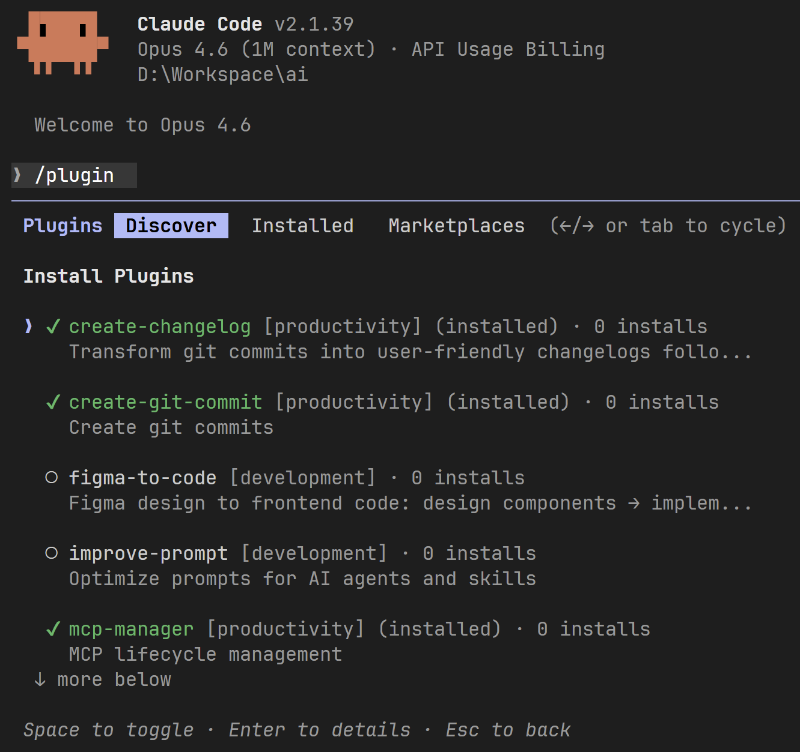

# AI

My Claude Code plugins.

## Installation

Add marketplace via Claude Code's plugin system:

```bash
/plugin marketplace add nonoroazoro/ai
```

Install plugins:

```bash
/plugin
```



## Plugins

- **create-changelog** - Transform git commits into user-friendly changelogs following [Keep a Changelog](https://keepachangelog.com/en/1.1.0/) specification
- **create-git-commit** - Create git commits
- **figma-to-code** - Figma design to frontend code: design components → implement → audit → iterate
- **improve-prompt** - Optimize prompts for AI agents and skills
- **mcp-manager** - MCP lifecycle management
- **memory-builder** - Knowledge graph management
- **tester** - Analyze, generate, and execute test cases
