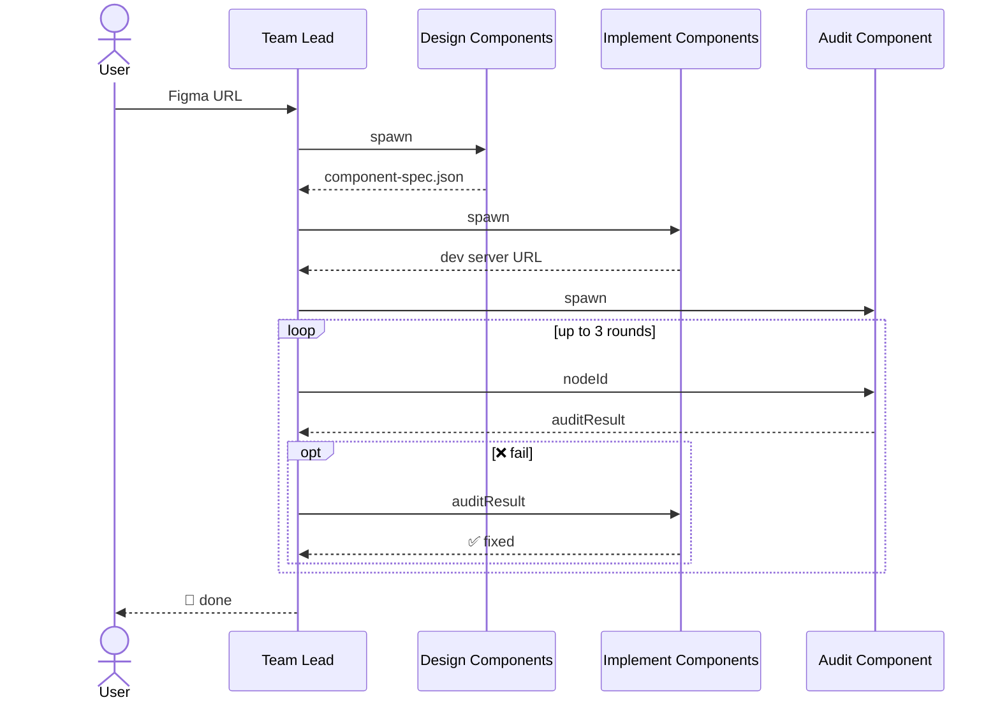

# figma-to-code

Takes a Figma URL and turns it into working frontend code. Built on [Claude Code Agent Teams](https://docs.anthropic.com/en/docs/claude-code/agent-teams), it spins up a team of specialized agents that decompose the design into a component spec, implement the code, then audit each node against the original design and fix issues.

## How it works



1. Team Lead: **figma-to-code** collects project context, manages the Agent Team
   - Resolve Figma URL, gather tech stack / styling / component library preferences
   - Phase 1: spawn `design-components`, wait for `component-spec.json`
   - Phase 2: spawn `implement-components`, wait for dev server URL
   - Phase 3: spawn `audit-component`, send each `nodeId` bottom-up, loop audit → fix up to 3 rounds
   - Summarize final results

2. Teammate: **design-components** decomposes the Figma design into a three-level component spec
   - Output `component-spec.json`: page → module → component, each mapped to a Figma `nodeId`
   - Output `component-spec-inspector.html` for user to visually verify the component design

3. Teammate: **implement-components** implements code based on `component-spec.json`
   - Scaffold the project if needed
   - Implement each node bottom-up (component → module → page), tag root elements with `data-node-id` for audit targeting
   - Receive `auditResult` from Team Lead and fix issues accordingly

4. Teammate: **audit-component** receives a `nodeId` from Team Lead, compares its Figma design against the running implementation
   - Visual comparison: Figma node screenshot vs Playwright element screenshot, both located by `node-id`
   - Style comparison: Figma node design context vs Playwright element `getComputedStyle()` on layout, spacing, typography, color, icons, border, shadow, etc.
   - Scoring: `1-10` with tolerances (font-size +-1px, color delta <= 10 RGB, spacing +-2px, ...), pass if `>= 8`
   - Output `auditResult` to Team Lead: nodeId, score, pass/fail, issues list (expected vs actual)

## Installation

See the [main README](../../../README.md#installation) for installation instructions.

**Requirements**:

- [Claude Code Agent Teams](https://docs.anthropic.com/en/docs/claude-code/agent-teams)
- [Figma Desktop MCP](https://www.npmjs.com/package/@anthropic-ai/claude-code-figma-mcp)
- [Playwright MCP](https://www.npmjs.com/package/@anthropic-ai/claude-code-playwright-mcp)

## Usage

One command to automatically create an Agent Team and handle everything:

```bash
/figma-to-code <figma-url>
```

Individual skills can be run standalone for debugging or partial re-runs:

| Skill | What it does |
|-------|--------------|
| `/figma-to-code:design-components <figma-url>` | Component decomposition |
| `/figma-to-code:implement-components [spec-path]` | Code generation |
| `/figma-to-code:audit-component <node-id> <dev-server-url>` | Audit a single node against its Figma design |

## Data

Persisted files live in `.figma-to-code/`:

- `component-spec.json` - the component tree
- `component-spec-inspector.html` - open in browser to visually inspect the spec
